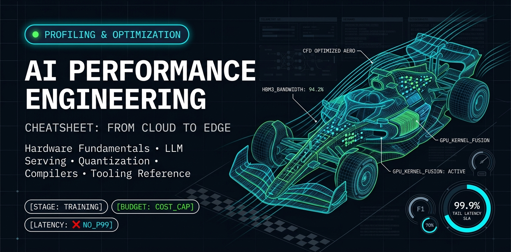

> *"L'optimisation prématurée est la racine de tous les maux - mais il ne faut pas laisser passer les occasions qui se présentent dans les 3 % critiques."* - Donald Knuth

[](./CONTRIBUTING.md) 

[English](./README.md) | **Français**



# Aide-mémoire d'ingénierie de la performance IA

> **Du cloud à la périphérie (edge)** — Une référence transversale couvrant les fondamentaux matériels, les métriques GPU/accélérateurs, le modèle roofline, les indicateurs d'entraînement et d'inférence IA/ML, le service de LLM, les systèmes distribués, la quantification, le déploiement cloud-native et en périphérie, le réseau, les optimisations de compilation et l'outillage pratique.

---

**Table des matières**

- [1. Métriques d'exécution de base (CPU)](#1-métriques-dexécution-de-base-cpu)
- [2. Métriques GPU et accélérateurs](#2-métriques-gpu-et-accélérateurs)
- [3. Temps, débit et latence](#3-temps-débit-et-latence)
- [4. Modèle roofline](#4-modèle-roofline)
- [5. Performance parallèle](#5-performance-parallèle)
- [6. Métriques mémoire et E/S](#6-métriques-mémoire-et-es)
- [7. Métriques système et files d'attente](#7-métriques-système-et-files-dattente)
- [8. Métriques d'entraînement IA/ML](#8-métriques-dentraînement-iaml)
- [9. Métriques d'inférence et de service IA/ML](#9-métriques-dinférence-et-de-service-iaml)
- [10. Métriques de performance spécifiques aux LLM](#10-métriques-de-performance-spécifiques-aux-llm)
- [11. Entraînement distribué et passage à l'échelle multi-appareils](#11-entraînement-distribué-et-passage-à-léchelle-multi-appareils)
- [12. Quantification et précision numérique](#12-quantification-et-précision-numérique)
- [13. Performance réseau et interconnexions](#13-performance-réseau-et-interconnexions)
- [14. Ingénierie de la performance dans le cloud](#14-ingénierie-de-la-performance-dans-le-cloud)
- [15. Performance de l'IA embarquée et en périphérie](#15-performance-de-lia-embarquée-et-en-périphérie)
- [16. Optimisations de compilation et d'exécution](#16-optimisations-de-compilation-et-dexécution)
- [17. Énergie, coût et durabilité](#17-énergie-coût-et-durabilité)
- [18. Référence outillage et profilage](#18-référence-outillage-et-profilage)
- [19. Synthèse pratique rapide](#19-synthèse-pratique-rapide)
- [20. Références](#20-références)

---

## 1. Métriques d'exécution de base (CPU)

### 1.1 Fréquence d'horloge (Clock Frequency)

- **Symbole :** $f_{\text{clock}}$
- **Unité :** Hz (cycles par seconde), souvent GHz
- **Signification :** nombre de cycles d'horloge que le processeur accomplit par seconde.

Exemple :
- 3.2 GHz => $f_{\text{clock}} = 3.2 \times 10^{9}\ \text{cycles/s}$

### 1.2 IPC (Instructions Per Cycle)

- **Formule :**
  $\displaystyle \text{IPC} = \frac{\text{Instructions retirées}}{\text{Cycles d'horloge}}$

- **Dérivée :**
  $\displaystyle \text{Inst/s} = \text{IPC} \times f_{\text{clock}}$

- **Interprétation :** nombre moyen d'instructions achevées par cycle d'horloge.


### 1.3 CPI (Cycles Per Instruction)

- **Formule :**
  $\displaystyle \text{CPI} = \frac{\text{Cycles d'horloge}}{\text{Instructions retirées}}$

- **Relation avec l'IPC :**
  $\displaystyle \text{IPC} = \frac{1}{\text{CPI}}, \qquad \text{CPI} = \frac{1}{\text{IPC}}$

### 1.4 FLOPS (opérations en virgule flottante par seconde)

#### 1.4.1 Pic théorique (par appareil)

- **Formule :**
  $\displaystyle \text{Pic FLOPS} = N_{\text{cores}} \times f_{\text{clock}} \times \text{FLOP par cycle et par cœur}$

Exemple (scalaire) :
- 1 cœur, 3 GHz, 1 FLOP/cycle => $3 \\,\text{GFLOPS}$.

Exemple (FMA vectoriel) :
- FMA 8 voies, 2 unités FP par cœur, 3 GHz :
  $\displaystyle \text{FLOP/cycle/cœur} = 8 \times 2 \times 2 = 32$

  $\displaystyle \text{Pic} = 3 \times 10^{9} \times 32 = 96\\,\text{GFLOPS}$

#### 1.4.2 FLOPS effectifs / mesurés

- **Formule :**
  $\displaystyle \text{FLOP/s effectifs} = \frac{\text{Opérations flottantes réellement exécutées}}{\text{Temps d'exécution}}$

- **Efficacité :**
  $\displaystyle \text{Efficacité FLOP} = \frac{\text{FLOP/s effectifs}}{\text{FLOP/s de pic}} \times 100\\%$

### 1.5 MAC (Multiply-Accumulate Operations)

- **Définition :**
  $\displaystyle a \gets a + (b \times c)$

- **MAC par seconde (par unité) :**
  $\displaystyle \text{MAC/s} = N_{\text{MAC/cycle}} \times f_{\text{clock}}$

- **GMAC :**
  $\displaystyle \text{GMAC} = \frac{\text{Nombre d'opérations MAC}}{10^{9}}$

- **Relation avec les FLOP (lorsqu'un MAC = 2 FLOP) :**
  $\displaystyle \text{FLOP} = 2 \times \text{MAC}$

### 1.6 Ratios du mélange d'instructions (Instruction Mix)

- **Fraction d'instructions FP :**
  $\displaystyle \text{Fraction FP} = \frac{\text{Instructions FP}}{\text{Instructions totales}}$

- **Fraction d'instructions mémoire :**
  $\displaystyle \text{Fraction inst. mémoire} = \frac{\text{Instructions Load/Store}}{\text{Instructions totales}}$

---

## 2. Métriques GPU et accélérateurs

### 2.1 Occupation des SM (Streaming Multiprocessor Occupancy)

$$
\text{Occupation} = \frac{\text{Warps actifs par SM}}{\text{Warps maximum par SM}} \times 100\\%
$$

- Une occupation élevée peut masquer la latence mémoire grâce à la commutation de warps.
- Limitée par l'usage des registres, l'allocation de mémoire partagée et la taille des blocs.

### 2.2 Efficacité d'exécution des warps (Warp Execution Efficiency)

$$
\text{Efficacité des warps} = \frac{\text{Threads actifs par warp}}{32} \times 100\\%
$$

- Les branchements divergents réduisent l'efficacité (les threads d'un même warp empruntent des chemins différents).

### 2.3 Utilisation des Tensor Cores / unités matricielles

$$
\text{Utilisation TC} = \frac{\text{Cycles où les Tensor Cores sont actifs}}{\text{Cycles totaux}} \times 100\\%
$$

- Les Tensor Cores effectuent une multiplication-accumulation matricielle en précision mixte (ex. entrées FP16 -> accumulateur FP32).
- Exemple de débit de pic (NVIDIA H100 SXM) : ~990 TFLOPS (FP16 Tensor), ~1,979 TFLOPS (FP8 Tensor).

### 2.4 Utilisation de la bande passante mémoire GPU

$$
\text{Utilisation BP} = \frac{\text{Bande passante atteinte}}{\text{Bande passante HBM de pic}} \times 100\\%
$$

- Exemple HBM3 (H100) : 3.35 TB/s de bande passante de pic.
- Exemple HBM3e (B200) : 8 TB/s de bande passante de pic.

### 2.5 Surcoût de lancement de kernel (Kernel Launch Overhead)

$$
T_{\text{kernel}} = T_{\text{launch}} + T_{\text{compute}} + T_{\text{sync}}
$$

- Surcoût de lancement : 5-20 us typiquement sur CUDA. Critique pour les petits kernels.
- La **fusion de kernels** élimine les lancements intermédiaires et les allers-retours en mémoire.

### 2.6 Classification GPU : limité par le calcul ou par la mémoire

| Indicateur | Limité par le calcul | Limité par la mémoire |
|-----------|--------------|--------------|
| Utilisation des SM | Élevée | Faible à moyenne |
| Utilisation de la BP mémoire | Faible à moyenne | Élevée (proche du pic) |
| Intensité arithmétique | Élevée | Faible |
| Stratégie de correction | Réduire les FLOP, baisser la précision | Améliorer la réutilisation des données, fusionner les kernels |

### 2.7 Métriques NPU / TPU / accélérateurs spécialisés

- **Utilisation du réseau systolique :** fraction des PE (Processing Elements) actifs par cycle.
- **La bande passante SRAM sur puce** dépasse souvent celle hors puce d'un facteur 10 à 100 ; le découpage en tuiles (tiling) est déterminant.
- **Utilisation de la MXU d'un TPU :**
  $\displaystyle \text{Util. MXU} = \frac{\text{Multiplications matricielles effectuées}}{\text{Capacité matricielle de pic}} \times 100\\%$

---

## 3. Temps, débit et latence

### 3.1 Temps d'exécution (latence)

- À partir du CPI :
  $\displaystyle T_{\text{exec}} = \frac{\text{Nombre d'instructions} \times \text{CPI}}{f_{\text{clock}}}$

- À partir de l'IPC :
  $\displaystyle T_{\text{exec}} = \frac{\text{Nombre d'instructions}}{\text{IPC} \times f_{\text{clock}}}$

### 3.2 Débit (Throughput)

Définition générique :

$$
\text{Débit} = \frac{\text{Travail accompli}}{\text{Temps}}
$$

Cas particuliers :

- Instructions : $\text{Inst/s} = \frac{\text{Nombre d'instructions}}{T_{\text{exec}}}$
- FLOP : $\text{FLOP/s} = \frac{\text{Opérations flottantes}}{T_{\text{exec}}}$
- Requêtes : $\text{Req/s} = \frac{\text{Nombre de requêtes servies}}{T_{\text{obs}}}$

### 3.3 Latence et débit (cas simple)

Pour un système entièrement pipeliné :

$$
\text{Débit} \approx \frac{1}{\text{Latence moyenne}}
$$

### 3.4 Latence de queue (latence en percentiles)

- Latences **P50** (médiane), **P95**, **P99**, **P99.9**.
- Déterminante pour les SLA en production. Un système peut afficher une bonne latence moyenne et une latence de queue inacceptable.
- **Règle empirique :** à grande échelle avec un fan-out $N$, la probabilité de tomber sur un nœud lent croît en $1 - (1 - p)^N$.

### 3.5 Accélération (Speedup)

Soit $T_1$ le temps de référence et $T_2$ le temps optimisé :

$$
S = \frac{T_1}{T_2}
$$

---

## 4. Modèle roofline

Le modèle roofline fournit une borne supérieure visuelle de la performance en fonction de l'intensité arithmétique.

### 4.1 Équation fondamentale

$$
\text{Performance atteignable (FLOP/s)} = \min\\!\Big(\text{FLOP/s de pic},\\;\text{BP de pic} \times \text{AI}\Big)
$$

Où :
- $\text{AI}$ = intensité arithmétique (FLOP / octet)
- $\text{BP de pic}$ = bande passante mémoire de pic (octets/s)

### 4.2 Point de rupture (Ridge Point)

Le croisement à partir duquel le modèle passe d'une limite mémoire à une limite calcul :

$$
\text{AI}_{\text{ridge}} = \frac{\text{FLOP/s de pic}}{\text{BP de pic}}
$$

- Si $\text{AI} < \text{AI}_{\text{ridge}}$ -> **limité par la mémoire** (optimiser les mouvements de données).
- Si $\text{AI} > \text{AI}_{\text{ridge}}$ -> **limité par le calcul** (optimiser l'arithmétique).

### 4.3 Intensités arithmétiques usuelles des charges IA

| Opération | AI typique (FLOP/octet) | Limite |
|-----------|------------------------|-------|
| Élément par élément (ReLU, addition) | 0.25 - 1 | Mémoire |
| Batch Norm | 1 - 5 | Mémoire |
| Convolution (grand batch) | 10 - 100 | Calcul |
| Multiplication matricielle (grande) | 50 - 200+ | Calcul |
| Attention (séquence longue) | 5 - 50 | Variable |
| Recherche dans une table d'embeddings | < 1 | Mémoire |

### 4.4 Roofline hiérarchique

Étendre le roofline avec plusieurs plafonds correspondant aux différents niveaux de mémoire :
- Roofline du **cache L1** -> bande passante la plus élevée, capacité la plus faible
- Roofline du **cache L2**
- Roofline **HBM / DRAM** -> bande passante la plus faible, capacité la plus grande

Chaque niveau ajoute un plafond de bande passante ; la performance du kernel est bornée par le plafond du niveau de mémoire qu'il sature.

---

## 5. Performance parallèle

### 5.1 Loi d'Amdahl

Soit $f$ la fraction du travail qui peut être accélérée et $s$ l'accélération de cette fraction :

$$
S = \frac{1}{(1 - f) + \frac{f}{s}}
$$

Cas particulier, parallélisation sur $N$ cœurs avec un passage à l'échelle idéal ($s = N$) :

$$
S_N = \frac{1}{(1 - f) + \frac{f}{N}}
$$

### 5.2 Loi de Gustafson

Pour des problèmes dont la taille croît avec $N$ processeurs :

$$
S_N^{\text{Gustafson}} = (1 - f) + N \cdot f
$$

### 5.3 Efficacité parallèle

Pour $N$ travailleurs :

$$
E_N = \frac{S_N}{N}
$$

### 5.4 Métrique d'équilibrage de charge

Soit $T_i$ le temps passé sur le travailleur $i$, et $T_{\max} = \max_i T_i$ :

$$
\text{Équilibrage de charge} = \frac{\left(\sum_i T_i / N\right)}{T_{\max}}
$$

### 5.5 Efficacité du passage à l'échelle (faible et fort)

- **Passage à l'échelle fort (strong scaling) :** taille totale du problème fixe, $N$ augmente.
  $\displaystyle E_{\text{strong}} = \frac{T_1}{N \cdot T_N}$

- **Passage à l'échelle faible (weak scaling) :** la taille du problème croît avec $N$ (travail constant par travailleur).
  $\displaystyle E_{\text{weak}} = \frac{T_1}{T_N}$

---

## 6. Métriques mémoire et E/S

### 6.1 Bande passante mémoire

Définition :

$$
\text{Bande passante} = \frac{\text{Octets transférés}}{\text{Seconde}}
$$

Exemple théorique (bus 64 bits, 3.2 GT/s) :

$$
\text{BP de pic} = 8\\,\text{octets} \times 3.2 \times 10^{9}\ \text{transferts/s}
$$

### 6.2 Latence mémoire

Conversion entre temps et cycles :

$$
\text{Latence (cycles)} = \text{Latence (secondes)} \times f_{\text{clock}}
$$

### 6.3 Intensité arithmétique (AI)

$$
\text{AI} = \frac{\text{Opérations en virgule flottante}}{\text{Octets transférés depuis la mémoire}}
$$

### 6.4 Taux de succès et d'échec du cache

- Taux de succès (hit ratio) :
  $\displaystyle \text{Taux de succès} = \frac{\text{Succès de cache}}{\text{Accès au cache}}$

- Taux d'échec (miss ratio) :
  $\displaystyle \text{Taux d'échec} = 1 - \text{Taux de succès} = \frac{\text{Échecs de cache}}{\text{Accès au cache}}$

### 6.5 Latences typiques de la hiérarchie mémoire

| Niveau | Latence | Bande passante (approx.) |
|-------|---------|---------------------|
| Cache L1 | ~1 ns (3-4 cycles) | ~1-4 TB/s |
| Cache L2 | ~3-10 ns | ~500 GB/s - 1 TB/s |
| Cache L3 | ~10-30 ns | ~200-500 GB/s |
| DRAM (DDR5) | ~50-100 ns | ~50-100 GB/s |
| HBM3 | ~80-120 ns | ~2-4 TB/s |
| SSD NVMe | ~10-100 us | ~5-14 GB/s |
| Réseau (RDMA) | ~1-5 us | ~25-400 Gb/s |

### 6.6 Débit d'E/S

$$
\text{Débit d'E/S} = \frac{\text{Octets lus ou écrits}}{\text{Seconde}}
$$

### 6.7 Débit du pipeline de chargement des données

Pour les charges IA, la boucle d'entraînement est souvent limitée par le chargement des données :

$$
\text{Taux de famine de données} = \frac{T_{\text{GPU inactif en attente de données}}}{T_{\text{pas total}}}
$$

- Viser un $\text{Taux de famine de données} \approx 0$ via le préchargement, des chargeurs de données multi-processus et l'augmentation de données sur GPU.

---

## 7. Métriques système et files d'attente

### 7.1 Utilisation du CPU / de l'appareil

Basée sur le temps :

$$
\text{Utilisation} = \frac{\text{Temps où l'appareil effectue un travail utile}}{\text{Temps total observé}} \times 100\\%
$$

### 7.2 Utilisation d'une unité (ex. FPU, Tensor Core)

$$
\text{Utilisation de l'unité} = \frac{\text{Cycles où l'unité est occupée}}{\text{Cycles totaux}} \times 100\\%
$$

### 7.3 Fraction de cycles bloqués (Stall Fraction)

$$
\text{Fraction de blocage} = \frac{\text{Cycles bloqués}}{\text{Cycles totaux}}
$$

### 7.4 Loi de Little

Pour un système stable :

$$
L = \lambda \times W
$$

Où :
- $L$ = nombre moyen d'éléments dans le système (concurrence)
- $\lambda$ = taux d'arrivée (éléments/s)
- $W$ = temps moyen passé dans le système par un élément (s)

Réarrangements :

$$
\lambda = \frac{L}{W}, \qquad W = \frac{L}{\lambda}
$$

**Appliquée au service d'inférence :** si l'on vise $\lambda = 100$ req/s avec une latence moyenne $W = 50$ ms :

$$
L = 100 \times 0.05 = 5 \text{ requêtes simultanées en vol}
$$

---

## 8. Métriques d'entraînement IA/ML

### 8.1 Débit d'entraînement

$$
\text{Échantillons/s} = \frac{\text{Taille du batch}}{T_{\text{step}}}
$$

$$
\text{Durée totale d'entraînement} \approx \frac{\text{Échantillons totaux (époques x taille du jeu de données)}}{\text{Échantillons/s}}
$$

### 8.2 FLOP du modèle (passe avant + passe arrière)

Pour un modèle Transformer à $L$ couches, de dimension cachée $H$, de longueur de séquence $S$ et de vocabulaire $V$ :

- **Passe avant par token (approx.) :**
  $\displaystyle \text{FLOP}_{\text{fwd}} \approx 2 \times P$
  où $P$ est le nombre de paramètres.

- **La passe arrière coûte environ 2x la passe avant**, d'où le total par token à l'entraînement :
  $\displaystyle \text{FLOP}_{\text{train/token}} \approx 6 \times P$

### 8.3 Utilisation des FLOP matériels (HFU / MFU)

- **Model FLOPs Utilization (MFU) :** ne compte que le calcul « utile » du modèle :
  $\displaystyle \text{MFU} = \frac{\text{FLOP du modèle par pas} / T_{\text{step}}}{\text{FLOP/s de pic de l'appareil}} \times 100\\%$

- **Hardware FLOPs Utilization (HFU) :** inclut tous les FLOP réellement exécutés par le matériel (rematérialisation, etc.) :
  $\displaystyle \text{HFU} = \frac{\text{Tous les FLOP par pas} / T_{\text{step}}}{\text{FLOP/s de pic de l'appareil}} \times 100\\%$

- Bonnes valeurs de MFU : 40-60 % (typique), plus de 60 % (excellent).

### 8.4 Efficacité de convergence

$$
\text{Échantillons jusqu'à la précision cible} = \text{Échantillons traités pour atteindre la métrique visée}
$$

$$
\text{Temps jusqu'à la précision cible} = \frac{\text{Échantillons jusqu'à la précision cible}}{\text{Échantillons/s}}
$$

- Utilisé par les benchmarks MLPerf Training.

### 8.5 Taille de batch effective avec accumulation de gradient

$$
\text{Taille de batch effective} = \text{Micro-batch} \times \text{Pas d'accumulation} \times N_{\text{GPUs}}
$$

### 8.6 Répartition de la mémoire GPU (entraînement)

| Composant | Mémoire approximative |
|-----------|-------------------|
| Paramètres du modèle | $2P$ octets (FP16) ou $4P$ octets (FP32) |
| Gradients | Identique aux paramètres |
| État de l'optimiseur (Adam) | $8P$-$12P$ octets (momentum + variance FP32 + poids maîtres) |
| Activations | proportionnelle à batch x seq_len x hidden x couches |
| **Total (FP16 + Adam)** | **~16P-20P octets** |

---

## 9. Métriques d'inférence et de service IA/ML

### 9.1 Décomposition de la latence d'inférence

$$
T_{\text{inference}} = T_{\text{preprocess}} + T_{\text{model}} + T_{\text{postprocess}} + T_{\text{network}}
$$

### 9.2 Compromis débit / latence avec le batching

Augmenter la taille du batch a généralement pour effet de :
- **Augmenter le débit** (meilleure utilisation du matériel, surcoûts amortis)
- **Augmenter la latence par requête** (délai de mise en file)

$$
\text{Débit} = \frac{B}{T_{\text{batch}}(B)}
$$

La taille de batch optimale maximise le débit tout en maintenant $T_{\text{batch}}(B) \leq \text{SLA}$.

### 9.3 Métriques SLA du service de modèles

| Métrique | Définition |
|--------|-----------|
| Latence P50 / P99 | Latence de bout en bout au 50e / 99e percentile |
| Débit (QPS) | Requêtes par seconde à la latence cible |
| Disponibilité | Requêtes réussies / requêtes totales x 100 % |
| Goodput | Débit des seules requêtes respectant le SLA |

### 9.4 Efficacité du batching dynamique

$$
\text{Taux de remplissage du batch} = \frac{\text{Taille de batch moyenne réelle}}{\text{Taille de batch maximale}} \times 100\\%
$$

### 9.5 Métriques de compression de modèle

$$
\text{Taux de compression} = \frac{\text{Taille du modèle d'origine}}{\text{Taille du modèle compressé}}
$$

$$
\text{Rétention de précision} = \frac{\text{Précision du modèle compressé}}{\text{Précision du modèle d'origine}} \times 100\\%
$$

---

## 10. Métriques de performance spécifiques aux LLM

### 10.1 Temps jusqu'au premier token (TTFT)

$$
\text{TTFT} = T_{\text{réception de la requête}} \to T_{\text{premier token généré}}
$$

Inclut le traitement du prompt (prefill). Déterminant pour la réactivité perçue.

### 10.2 Temps par token de sortie (TPOT)

$$
\text{TPOT} = \frac{T_{\text{generation}} - \text{TTFT}}{\text{Nombre de tokens de sortie} - 1}
$$

Détermine la vitesse de défilement perçue par l'utilisateur.

### 10.3 Débit en tokens

- **Par requête :**
  $\displaystyle \text{Tokens/s (par requête)} = \frac{\text{Tokens de sortie}}{T_{\text{generation}}}$

- **À l'échelle du système :**
  $\displaystyle \text{Tokens/s (système)} = \frac{\text{Tokens générés sur l'ensemble des requêtes}}{T_{\text{observation}}}$

### 10.4 Phases de prefill et de decode

| Phase | Caractéristique | Goulot d'étranglement |
|-------|---------------|------------|
| **Prefill** | Traite tous les tokens d'entrée en parallèle | Limité par le calcul (grandes multiplications matricielles) |
| **Decode** | Génère les tokens un par un (autorégressif) | Limité par la mémoire (lectures du cache KV, faible intensité arithmétique) |

### 10.5 Mémoire du cache KV

$$
\text{Cache KV par token} = 2 \times L \times H \times \text{octets par élément}
$$

$$
\text{Cache KV (total)} = \text{Cache KV par token} \times S \times B
$$

Où : $L$ = couches, $H$ = dimension cachée, $S$ = longueur de séquence, $B$ = taille du batch.

- Pour Llama 3 70B (FP16) : ~1.3 MB par token -> 1K tokens = ~1.3 GB par requête.

### 10.6 Techniques d'optimisation du service de LLM

| Technique | Effet |
|-----------|--------|
| **Batching continu** | Ajoute/retire dynamiquement des requêtes du batch -> meilleure utilisation du GPU |
| **PagedAttention (vLLM)** | Pages de cache KV non contiguës -> supprime la fragmentation mémoire, +2-4x de débit |
| **Décodage spéculatif** | Un modèle brouillon propose des tokens, le modèle cible les vérifie en parallèle -> latence réduite |
| **Cache de préfixe** | Réutilise le cache KV des préfixes de prompt partagés -> TTFT réduit sur les préfixes répétés |
| **Cache KV quantifié** | Cache KV en INT8/FP8 -> 2x plus de requêtes simultanées |
| **Flash Attention** | Attention exacte optimisée pour les E/S -> moins de mémoire, calcul plus rapide |

### 10.7 Métriques de benchmark des LLM

| Benchmark | Ce qu'il mesure |
|-----------|-----------------|
| **MMLU / MMLU-Pro** | Précision des connaissances multi-domaines |
| **HumanEval / MBPP** | Génération de code, pass@k |
| **MT-Bench** | Qualité des conversations multi-tours |
| **Chatbot Arena (ELO)** | Classement par préférence humaine |
| **MLPerf Inference** | Latence / débit normalisés |

---

## 11. Entraînement distribué et passage à l'échelle multi-appareils

### 11.1 Parallélisme de données

Chaque travailleur reçoit une copie complète du modèle et un fragment des données :

$$
\text{Débit}_{\text{DP}} \approx N \times \text{Débit}_{\text{single}} \times E_{\text{comm}}
$$

Où $E_{\text{comm}} < 1$ rend compte du surcoût de synchronisation des gradients.

### 11.2 Surcoût de communication (AllReduce)

Pour un AllReduce en anneau avec $N$ nœuds et des messages de taille $M$ :

$$
T_{\text{AllReduce}} \approx 2 \times \frac{N - 1}{N} \times \frac{M}{\text{BW}} + 2(N - 1) \times \alpha
$$

Où $\alpha$ = latence par message, $\text{BW}$ = bande passante par lien.

### 11.3 Taux de recouvrement calcul-communication

$$
\text{Taux de recouvrement} = \frac{\text{Temps de communication masqué par le calcul}}{\text{Temps de communication total}}
$$

Idéal : taux de recouvrement -> 100 % (communication entièrement masquée).

### 11.4 Parallélisme de modèle

**Parallélisme de tenseur (TP) :** répartit les couches individuelles entre les appareils.

$$
\text{Comm. par couche (TP)} = 2 \times \text{AllReduce}(\text{taille des activations})
$$

**Parallélisme de pipeline (PP) :** affecte des couches différentes à des appareils différents.

$$
\text{Fraction de bulle du pipeline} = \frac{P - 1}{\text{Micro-batches} + P - 1}
$$

Où $P$ = nombre d'étages du pipeline. Augmenter le nombre de micro-batches réduit la bulle.

### 11.5 Parallélisme 3D

$$
N_{\text{total GPUs}} = N_{\text{DP}} \times N_{\text{TP}} \times N_{\text{PP}}
$$

### 11.6 Parallélisme d'experts (MoE)

$$
\text{Temps All-to-All} \propto \frac{B \times S \times H \times k}{N_{\text{experts}} \times \text{BW}}
$$

- $k$ = nombre d'experts top-k par token
- Le déséquilibre de charge entre experts dégrade l'efficacité ; les pertes auxiliaires y remédient en partie.

### 11.7 Étages de ZeRO (Zero Redundancy Optimizer)

| Étage ZeRO | Ce qui est partitionné | Gain mémoire (par GPU) |
|------------|-------------------|------------------------|
| Étage 1 | États de l'optimiseur | réduction ~4x |
| Étage 2 | + Gradients | réduction ~8x |
| Étage 3 | + Paramètres | réduction ~Nx (N = nombre de GPU) |

---

## 12. Quantification et précision numérique

### 12.1 Types de données et leurs propriétés

| Type | Bits | Plage (approx.) | Cas d'usage IA |
|------|------|-----------------|-------------|
| FP32 | 32 | +/-3.4x10^38 | Référence / poids maîtres |
| TF32 | 19 | Identique à FP32 (mantisse 10 bits) | Multiplications matricielles NVIDIA Ampere+ |
| BF16 | 16 | +/-3.4x10^38 (mantisse 7 bits) | Entraînement (large plage) |
| FP16 | 16 | +/-65,504 (mantisse 10 bits) | Entraînement / inférence |
| FP8 (E4M3) | 8 | +/-448 | Inférence et entraînement (Hopper+) |
| FP8 (E5M2) | 8 | +/-57,344 | Gradients |
| INT8 | 8 | -128 à 127 | Quantification post-entraînement |
| INT4 | 4 | -8 à 7 | Quantification des poids seuls (GPTQ, AWQ) |
| Binaire / ternaire | 1-2 | {-1, 0, 1} | Périphérie à très faible consommation |

### 12.2 Modèle d'accélération par quantification

$$
\text{Accélération théorique} \leq \frac{\text{Bits}_{\text{origine}}}{\text{Bits}_{\text{quantifié}}}
$$

En pratique, bornée par le surcoût de déquantification, l'alignement mémoire et la prise en charge par les kernels.

### 12.3 Quantification pendant l'entraînement (QAT) ou après (PTQ)

| Approche | Précision | Coût | Quand l'utiliser |
|----------|----------|------|-------------|
| **PTQ** | Bonne en INT8, se dégrade en INT4 | Faible (quelques minutes) | Grands modèles, déploiement rapide |
| **GPTQ / AWQ** | Bonne en INT4 sur les poids seuls | Modéré (quelques heures) | Inférence LLM |
| **QAT** | Meilleure préservation de la précision | Élevé (réentraînement complet) | Déploiement en périphérie, précision stricte |

### 12.4 Entraînement en précision mixte

- Passe avant : FP16/BF16
- Mise à l'échelle de la perte (loss scaling) : dynamique, pour éviter le soupassement
- Poids maîtres et optimiseur : FP32
- Passe arrière : gradients FP16/BF16

Gain mémoire : environ 2x sur les activations et les gradients.

---

## 13. Performance réseau et interconnexions

### 13.1 Bande passante et latence

$$
T_{\text{transfer}} = \frac{\text{Taille du message}}{\text{Bande passante}} + \text{Latence}
$$

### 13.2 Bande passante de bissection

$$
\text{BP de bissection} = \text{BP agrégée minimale sur toute coupe divisant le réseau en deux}
$$

Déterminante pour les schémas de communication all-to-all.

### 13.3 Interconnexions courantes en IA

| Interconnexion | Bande passante (par lien) | Latence | Topologie |
|-------------|---------------------|---------|----------|
| PCIe Gen5 x16 | 64 GB/s | ~100 ns | Point à point |
| NVLink 4 (H100) | 900 GB/s (total) | ~1 us | Entièrement connecté (8 GPU) |
| NVLink 5 (B200) | 1.8 TB/s (total) | <1 us | NVLink Switch |
| InfiniBand NDR | 400 Gb/s (50 GB/s) | ~1 us | Fat tree |
| InfiniBand XDR | 800 Gb/s (100 GB/s) | ~1 us | Fat tree / Dragonfly |
| RoCE v2 | 100-400 Gb/s | ~2-5 us | Fabric Ethernet |
| Intel Gaudi3 Scale-up | 300 GB/s (par puce) | ~1 us | Maillage |

### 13.4 Impact de la topologie réseau

$$
\text{Coût de communication} \propto \text{Sauts} \times \frac{\text{Taille du message}}{\text{BP par saut}}
$$

- **Fat-tree** : bande passante de bissection uniforme, adapté à l'AllReduce.
- **Dragonfly / tore** : moins coûteux, mais dépendant du schéma de trafic.

### 13.5 RDMA et GPUDirect

- **GPUDirect RDMA :** mémoire GPU <-> réseau sans transit par le CPU -> supprime la latence de copie.
- **GPUDirect Storage :** GPU <-> NVMe sans passer par le CPU -> checkpointing plus rapide.
- **NCCL** : bibliothèque NVIDIA de communications collectives optimisée pour le multi-GPU et le multi-nœud.

---

## 14. Ingénierie de la performance dans le cloud

### 14.1 Métriques de choix d'instance

$$
\text{Rapport coût-efficacité} = \frac{\text{Performance (tokens/s, échantillons/s, etc.)}}{\text{USD/heure}}
$$

### 14.2 Comparaison d'instances GPU cloud (typique)

| Instance cloud | GPU | Mémoire GPU | Interconnexion | USD/h (approx.) |
|---------------|-----|------------|--------------|----------------|
| AWS p5.48xlarge | 8x H100 | 640 GB HBM3 | NVSwitch + EFA | ~60-98 |
| AWS p5e.48xlarge | 8x H200 | 1.13 TB HBM3e | NVSwitch + EFA | ~80-120 |
| GCP a3-megagpu-8g | 8x H100 | 640 GB HBM3 | NVSwitch + GPUDirect | ~60-100 |
| Azure ND H100 v5 | 8x H100 | 640 GB HBM3 | NVSwitch + InfiniBand | ~60-100 |
| AWS inf2.48xlarge | 12x Inferentia2 | 384 GB | NeuronLink | ~12 |

*Les tarifs varient selon la région, l'engagement et la disponibilité en spot.*

### 14.3 Stratégie d'instances spot / préemptibles

$$
\text{Coût effectif} = \text{Prix spot} \times \frac{T_{\text{total avec préemptions}}}{T_{\text{idéal}}}
$$

- Utiliser le **checkpointing** pour survivre aux préemptions.
- **Surcoût de checkpointing :** viser moins de 5 % du temps de pas.

### 14.4 Métriques d'auto-scaling

$$
\text{Déclencheur de montée en charge :} \quad \text{Profondeur de file moyenne} > \theta_{\text{high}} \\;\text{pendant}\\; t > t_{\text{window}}
$$

$$
\text{Latence de démarrage à froid} = T_{\text{provision}} + T_{\text{chargement du modèle}} + T_{\text{warmup}}
$$

- Démarrage à froid typique : 10 s à 5 min (selon la taille du modèle et le framework).
- Atténuation : politiques keep-warm, conteneurs pré-construits, mise en cache des modèles.

### 14.5 Considérations multi-région et cloud-périphérie

$$
T_{\text{bout-en-bout}} = T_{\text{client-périphérie}} + T_{\text{traitement périphérie}} + T_{\text{périphérie-cloud}} + T_{\text{traitement cloud}}
$$

- Le **routage géographique** minimise $T_{\text{client-périphérie}}$.
- **Hiérarchisation de modèles :** petit modèle en périphérie, repli sur un grand modèle dans le cloud.

---

## 15. Performance de l'IA embarquée et en périphérie

### 15.1 Contraintes de déploiement en périphérie

| Contrainte | Plage typique |
|-----------|--------------|
| Budget énergétique | 1-30 W (SoC mobile : ~5 W, serveur edge : ~300 W) |
| Mémoire | 2-16 GB (partagée CPU+GPU) |
| Stockage | 32-256 GB eMMC / NVMe |
| SLA de latence | 1-50 ms (temps réel) |
| Connectivité | Intermittente ou à bande passante limitée |

### 15.2 Métriques de performance de l'IA en périphérie

$$
\text{TOPS} = \text{Tera-opérations par seconde (INT8 ou INT4)}
$$

$$
\text{TOPS/W} = \frac{\text{TOPS}}{\text{Puissance (watts)}}
$$

| Puce edge | TOPS (INT8) | TOPS/W | TDP |
|-----------|------------|--------|-----|
| NVIDIA Jetson Orin NX 16GB | 100 | ~5 | 25 W |
| Apple M4 Neural Engine | 38 | ~19 | ~5 W (NE seul) |
| Google Coral Edge TPU | 4 | ~2 | 2 W |
| Qualcomm Snapdragon 8 Gen 3 (NPU Hexagon) | 73 | ~15 | ~5 W |
| Intel Meteor Lake NPU | 11 | ~5 | ~10 W |
| Hailo-8L | 13 | ~13 | 1.5 W |

### 15.3 Pile d'optimisation sur appareil

```
Application
    |
Optimisation du modèle (élagage, quantification, distillation)
    |
Format de modèle (ONNX, TFLite, Core ML, TensorRT, OpenVINO)
    |
Runtime (ONNX Runtime, TFLite, SNPE, QNN, TensorRT)
    |
Matériel (CPU / GPU / NPU / DSP)
```

### 15.4 Performance temps réel

$$
\text{Temps réel atteignable} \iff T_{\text{inference}} \leq T_{\text{budget par image}}
$$

À 30 FPS : $T_{\text{frame}} = 33.3$ ms. À 60 FPS : $T_{\text{frame}} = 16.7$ ms.

### 15.5 Techniques d'optimisation de modèle pour la périphérie

| Technique | Réduction de taille | Impact sur la précision | Impact sur la latence |
|-----------|---------------------|-----------------|----------------|
| Quantification INT8 | 4x | < 1 % de perte (typiquement) | 2-4x plus rapide |
| Quantification INT4 | 8x | 1-3 % de perte | 3-6x plus rapide |
| Élagage structuré | 2-10x | 0.5-3 % de perte | 2-5x plus rapide |
| Distillation de connaissances | S.O. (architecture plus petite) | < 2 % de perte | Dépend du modèle élève |
| Recherche d'architecture neuronale | Dépend du modèle | Souvent meilleure | Optimisée pour la cible |

---

## 16. Optimisations de compilation et d'exécution

### 16.1 Optimisations au niveau du graphe

| Optimisation | Description | Outils |
|-------------|-------------|-------|
| **Fusion d'opérateurs** | Fusionne des opérations consécutives en un seul kernel (ex. Conv+BN+ReLU) | TensorRT, XLA, TVM, torch.compile |
| **Propagation de constantes** | Pré-calcule les expressions statiques | Tous les compilateurs |
| **Élimination de code mort** | Supprime les nœuds inutilisés | Tous les compilateurs |
| **Optimisation de disposition** | NCHW <-> NHWC selon le matériel cible | TensorRT, OneDNN, XNNPACK |
| **Élimination des sous-expressions communes** | Réutilise les calculs identiques | XLA, Glow |

### 16.2 Optimisations au niveau du kernel

| Optimisation | Description |
|-------------|-------------|
| **Découpage en tuiles / blocage de boucles** | Faire tenir le jeu de travail en cache/SRAM |
| **Vectorisation** | Utiliser les instructions SIMD/SIMT |
| **Déroulage de boucles** | Réduire le surcoût de boucle, favoriser l'ILP |
| **Coalescence mémoire** | Aligner les accès mémoire GPU pour l'efficacité à l'échelle du warp |
| **Blocage de registres** | Maximiser la réutilisation des registres dans les multiplications matricielles |

### 16.3 Principaux compilateurs et runtimes IA

| Outil | Portée | Caractéristique clé |
|------|-------|-------------|
| **torch.compile (Dynamo + Inductor)** | Graphes PyTorch | Traçage au niveau Python + génération de code Triton |
| **XLA** | TensorFlow / JAX | Optimisation du programme entier, prise en charge TPU |
| **TensorRT** | Inférence NVIDIA | Calibration INT8/FP16, fusion de couches, construction de moteurs |
| **TVM / Apache TVM** | Multiplateforme | Auto-tuning, BYOC, cibles edge |
| **ONNX Runtime** | Inférence multiplateforme | Execution providers (CUDA, TensorRT, OpenVINO, CoreML) |
| **OpenVINO** | CPU / GPU / VPU Intel | Quantification INT8, model optimizer |
| **Core ML** | Apple Silicon | Répartition vers le Neural Engine, optimisation ANE |
| **Triton (OpenAI)** | Écriture de kernels GPU | Python -> kernels GPU optimisés |
| **MLIR** | Infrastructure de compilation | IR multi-niveaux pour la compilation hétérogène |

### 16.4 Compilation JIT ou AOT

| Aspect | JIT (Just-In-Time) | AOT (Ahead-Of-Time) |
|--------|----|----|
| Moment de compilation | À l'exécution (pénalité au premier lancement) | À la construction |
| Portée de l'optimisation | Formes dynamiques, informations d'exécution | Formes statiques uniquement |
| Déploiement | Nécessite le compilateur à l'exécution | Binaire autonome |
| Cas d'usage | Recherche, modèles dynamiques | Production, appareils en périphérie |

---

## 17. Énergie, coût et durabilité

### 17.1 Puissance et énergie

- Puissance :
  $\displaystyle P = \frac{\text{Énergie}}{\text{Temps}}$

- Énergie par opération :
  $\displaystyle E_{\text{op}} = \frac{\text{Énergie consommée}}{\text{Nombre d'opérations}}$

- Efficacité énergétique :
  $\displaystyle \text{FLOP/J} = \frac{\text{FLOP}}{\text{Énergie}}$

### 17.2 Performance par watt

$$
\text{Perf/W} = \frac{\text{Métrique de performance}}{\text{Puissance}}
$$

Exemples : GFLOPS/W, images/s/W, tokens/s/W

### 17.3 Performance par dollar

$$
\text{Perf/\\$} = \frac{\text{Métrique de performance}}{\text{Coût}}
$$

### 17.4 Coût total de possession (TCO)

$$
\text{TCO} = \text{CapEx} + \text{OpEx sur la durée de vie}
$$

Où :
- **CapEx :** matériel, réseau, aménagement des locaux
- **OpEx :** électricité, refroidissement, maintenance, personnel, frais cloud

Comparer le rapport Perf/TCO entre les options.

### 17.5 Empreinte carbone de l'entraînement IA

$$
\text{CO}_2\text{e} = \text{Énergie (kWh)} \times \text{Intensité carbone (g CO}_2\text{/kWh)}
$$

- Énergie = puissance x temps
- L'intensité carbone varie selon la région (50-800 g CO2/kWh).
- PUE (Power Usage Effectiveness) d'un centre de données : 1.1-1.8 typiquement.

$$
\text{Énergie totale} = \text{Énergie informatique} \times \text{PUE}
$$

---

## 18. Référence outillage et profilage

### 18.1 Profilage GPU

| Outil | Plateforme | Usage |
|------|----------|---------|
| `nvidia-smi` | NVIDIA | Utilisation GPU, mémoire, température et puissance en temps réel |
| `nvtop` / `gpustat` | NVIDIA | Supervision GPU interactive |
| **NVIDIA Nsight Systems** | NVIDIA | Chronologie à l'échelle du système (CPU+GPU+réseau) |
| **NVIDIA Nsight Compute** | NVIDIA | Profilage GPU au niveau du kernel (occupation, roofline) |
| **NVIDIA DCGM** | NVIDIA | Santé et métriques des GPU de centre de données |
| `rocm-smi` / `rocprof` | AMD | Profilage GPU ROCm |
| **Intel VTune** | Intel | Profilage CPU et GPU |
| **AMD Omniperf** | AMD | Profilage de kernels sur série MI |

### 18.2 Profilage des frameworks IA

| Outil | Framework | Usage |
|------|-----------|---------|
| `torch.profiler` | PyTorch | Niveau opérateur + export de traces (avec TensorBoard) |
| `torch.cuda.Event` | PyTorch | Chronométrage CUDA précis |
| `jax.profiler` | JAX | Trace HLO de XLA |
| **TensorBoard Profiler** | TF / PyTorch / JAX | Chronologie visuelle, statistiques d'opérateurs, mémoire |
| **Weights & Biases** | Tous | Suivi d'expériences + métriques système |
| **MLflow** | Tous | Suivi d'expériences + registre de modèles |
| **DeepSpeed Flops Profiler** | DeepSpeed | Comptage des FLOP + profilage des communications |

### 18.3 Profilage système (Linux)

| Outil | Usage |
|------|---------|
| `perf` | Compteurs de performance CPU, graphes d'appels |
| `top` / `htop` / `btop` | Vue d'ensemble CPU et mémoire par processus |
| `vmstat` / `iostat` / `sar` | Statistiques mémoire, E/S, CPU |
| `mpstat` | Utilisation par CPU |
| `pidstat` | Statistiques par processus |
| `strace` / `ltrace` | Traçage des appels système / de bibliothèque |
| `bpftrace` / outils BCC | Traçage dynamique via eBPF |
| `numactl` / `lstopo` | Prise en compte de la topologie NUMA |
| `turbostat` | Fréquence CPU, C-states, puissance |
| `pcm` | Intel Performance Counter Monitor |

**La checklist 60 secondes de Brendan Gregg :**
```bash
uptime                  # charges moyennes
dmesg | tail            # erreurs noyau
vmstat 1                # CPU, mémoire, E/S
mpstat -P ALL 1         # équilibre par CPU
pidstat 1               # CPU par processus
iostat -xz 1            # E/S disque
free -m                 # utilisation mémoire
sar -n DEV 1            # E/S réseau
sar -n TCP,ETCP 1       # statistiques TCP
top                     # vue d'ensemble
```

### 18.4 Outils d'optimisation de l'inférence

| Outil | Usage |
|------|---------|
| **TensorRT** | Optimisation de l'inférence sur GPU NVIDIA (INT8, calibration FP16, fusion) |
| **ONNX Runtime** | Inférence optimisée multiplateforme |
| **OpenVINO** | Optimisation de l'inférence sur matériel Intel |
| **Core ML Tools** | Optimisation pour Apple Silicon |
| **TFLite** | Inférence mobile / embarquée |
| **vLLM** | Service de LLM à haut débit (PagedAttention) |
| **TGI** (Text Generation Inference) | Service de LLM par HuggingFace |
| **SGLang** | Service de LLM rapide avec RadixAttention |
| **llama.cpp** | Inférence LLM sur CPU/GPU (quantification GGUF) |
| **MLC LLM** | Déploiement universel de LLM (téléphone, navigateur, GPU) |

### 18.5 Outils de benchmark

| Outil | Usage |
|------|---------|
| **MLPerf** (Training & Inference) | Benchmarks IA de référence du secteur |
| `sysbench` | Micro-benchmarks CPU, mémoire, E/S |
| `fio` | Benchmark des E/S de stockage |
| `iperf3` | Test de bande passante réseau |
| `likwid` | Boîte à outils de compteurs de performance matériels |
| `STREAM` | Benchmark de bande passante mémoire |
| `HPL` / `HPL-MxP` | LINPACK pour le HPC / la précision mixte |
| **LM Evaluation Harness** | Benchmarks de précision des LLM |
| **LLMPerf** (Anyscale) | Débit et latence du service de LLM |

---

## 19. Synthèse pratique rapide

| Objectif | Métriques et outils clés |
|------|-------------------|
| **Modéliser la performance du cœur** | IPC/CPI, fréquence d'horloge, nombre d'instructions |
| **Débit de calcul** | FLOP/s, MAC/s, intensité arithmétique, modèle roofline |
| **Utilisation du GPU** | Occupation des SM, utilisation des Tensor Cores, utilisation de la BP mémoire |
| **Efficacité de l'entraînement** | MFU, échantillons/s, temps jusqu'à la précision cible, efficacité du passage à l'échelle |
| **Latence d'inférence** | Latences P50/P95/P99, TTFT, TPOT, stratégie de batching |
| **Service de LLM** | Tokens/s, mémoire du cache KV, goulot prefill ou decode |
| **Parallélisme et passage à l'échelle** | Amdahl/Gustafson, passage à l'échelle fort/faible, recouvrement des communications |
| **Goulots mémoire** | Taux de succès du cache, utilisation de la bande passante, famine de données |
| **Quantification** | Accélération INT8/INT4, rétention de précision, taux de compression |
| **Efficacité des coûts cloud** | Perf/$, stratégies spot, auto-scaling, latence de démarrage à froid |
| **Déploiement en périphérie** | TOPS/W, faisabilité temps réel, pile d'optimisation sur appareil |
| **Comportement du système** | Loi de Little (concurrence), latence de queue, utilisation |
| **Énergie et durabilité** | FLOP/J, Perf/W, TCO, empreinte CO2e |

---

## 20. Références

Les ressources ci-dessous sont en anglais ; leurs titres sont conservés tels quels.

### Cours et conférences
- [MIT 6.172 - Performance Engineering of Software Systems (YouTube)](https://www.youtube.com/watch?v=o7h_sYMk_oc&list=PLUl4u3cNGP63VIBQVWguXxZZi0566y7Wf)
  - [MIT 6.172 Labs (GitHub)](https://github.com/simonaertssen/MIT-6.172-Performance-Engineering-of-Software-Systems)
- [Stanford CS149 - Parallel Computing](https://gfxcourses.stanford.edu/cs149)
- [CMU 15-418/618 - Parallel Computer Architecture and Programming](https://www.cs.cmu.edu/~418/)

### Ingénierie de la performance
- [Performance engineering - Wikipedia](https://en.wikipedia.org/wiki/Performance_engineering)
- [Network performance - Wikipedia](https://en.wikipedia.org/wiki/Network_performance)
- [Roofline model - Wikipedia](https://en.wikipedia.org/wiki/Roofline_model)

### Architecture et matériel
- [Clock rate - Wikipedia](https://en.wikipedia.org/wiki/Clock_rate)
- [Speedup - Wikipedia](https://en.wikipedia.org/wiki/Speedup)
- [Transistor count - Wikipedia](https://en.wikipedia.org/wiki/Transistor_count)
- [Multiply-accumulate operation (MAC) - Wikipedia](https://en.wikipedia.org/wiki/Multiply%E2%80%93accumulate_operation)
- [Floating point operations per second - Wikipedia](https://en.wikipedia.org/wiki/Floating_point_operations_per_second)
- [Processor (computing) - Wikipedia](https://en.wikipedia.org/wiki/Processor_(computing))
- [Computer performance - Wikipedia](https://en.wikipedia.org/wiki/Computer_performance)
- [Computer performance by orders of magnitude - Wikipedia](https://en.wikipedia.org/wiki/Computer_performance_by_orders_of_magnitude)
- [Hardware acceleration - Wikipedia](https://en.wikipedia.org/wiki/Hardware_acceleration)

### GPU et accélérateurs
- [NVIDIA H100 Datasheet](https://resources.nvidia.com/en-us-tensor-core)
- [NVIDIA CUDA C++ Programming Guide](https://docs.nvidia.com/cuda/cuda-c-programming-guide/)
- [NVIDIA Nsight Systems Documentation](https://docs.nvidia.com/nsight-systems/)
- [NVIDIA Nsight Compute Documentation](https://docs.nvidia.com/nsight-compute/)
- [Google TPU Documentation](https://cloud.google.com/tpu/docs)

### Performance IA/ML
- [MLPerf - ML Commons](https://mlcommons.org/benchmarks/)
- [Efficient Processing of Deep Neural Networks (Sze et al.) - Book](https://www.morganclaypoolpublishers.com/catalog_Orig/product_info.php?products_id=1530)
- [FlashAttention - Dao et al.](https://arxiv.org/abs/2205.14135)
- [vLLM: Easy, Fast, and Cheap LLM Serving with PagedAttention](https://arxiv.org/abs/2309.06180)
- [Megatron-LM - NVIDIA](https://github.com/NVIDIA/Megatron-LM)
- [DeepSpeed - Microsoft](https://github.com/microsoft/DeepSpeed)
- [ZeRO: Memory Optimizations for Training Billion Parameter Models (Rajbhandari et al.)](https://arxiv.org/abs/1910.02054)

### Quantification
- [A Survey of Quantization Methods for Efficient Neural Network Inference (Gholami et al.)](https://arxiv.org/abs/2103.13630)
- [GPTQ: Accurate Post-Training Quantization for Generative Pre-trained Transformers](https://arxiv.org/abs/2210.17323)
- [AWQ: Activation-aware Weight Quantization](https://arxiv.org/abs/2306.00978)

### Benchmark et profilage
- [Profiling (computer programming) - Wikipedia](https://en.wikipedia.org/wiki/Profiling_(computer_programming))
- [Benchmark (computing) - Wikipedia](https://en.wikipedia.org/wiki/Benchmark_(computing))
- [Software performance testing - Wikipedia](https://en.wikipedia.org/wiki/Software_performance_testing)
- [Analysis of algorithms - Wikipedia](https://en.wikipedia.org/wiki/Analysis_of_algorithms)
- [Best, worst and average case - Wikipedia](https://en.wikipedia.org/wiki/Best,_worst_and_average_case)

### Efficacité et durabilité
- [Algorithmic efficiency - Wikipedia](https://en.wikipedia.org/wiki/Algorithmic_efficiency)
- [Performance per watt - Wikipedia](https://en.wikipedia.org/wiki/Performance_per_watt)
- [Green computing - Wikipedia](https://en.wikipedia.org/wiki/Green_computing)
- [Environmental impact of artificial intelligence - Wikipedia](https://en.wikipedia.org/wiki/Environmental_impact_of_artificial_intelligence)

### Compilateurs et optimisation
- [Program optimization - Wikipedia](https://en.wikipedia.org/wiki/Program_optimization)
- [Optimizing compiler - Wikipedia](https://en.wikipedia.org/wiki/Optimizing_compiler)
- [torch.compile Documentation](https://pytorch.org/docs/stable/torch.compiler.html)
- [XLA - Accelerated Linear Algebra](https://openxla.org/xla)
- [Apache TVM](https://tvm.apache.org/)
- [Triton Language (OpenAI)](https://triton-lang.org/)
- [MLIR - Multi-Level IR Compiler Framework](https://mlir.llvm.org/)

### Calcul haute performance
- [TOP500 - Wikipedia](https://en.wikipedia.org/wiki/TOP500)
- [Supercomputer - Wikipedia](https://en.wikipedia.org/wiki/Supercomputer)

### Performance sous Linux
- [Linux Performance Analysis in 60,000 Milliseconds - Brendan Gregg @ Netflix](https://netflixtechblog.com/linux-performance-analysis-in-60-000-milliseconds-accc10403c55)
- [Linux Systems Performance - Brendan Gregg](https://www.brendangregg.com/linuxperf.html)
- [Top 10 ways to monitor Linux in the console - Jeff Geerling](https://www.jeffgeerling.com/blog/2025/top-10-ways-monitor-linux-console)

### Billets de blog et articles
- [AI Performance Engineering (2025-2026 Edition): Latency, Throughput, Cost Optimization & Real-World Benchmarking - Robi Kumar Tomar](https://medium.com/@robi.tomar72/ai-performance-engineering-2025-2026-edition-latency-throughput-cost-optimization-142eec0daece)
- [Efficiently Scaling Transformer Inference - Pope et al. (Google)](https://arxiv.org/abs/2211.05102)
- [LLM Inference Performance Engineering: Best Practices - NVIDIA Technical Blog](https://developer.nvidia.com/blog/mastering-llm-techniques-inference-optimization/)

### Livres : [éditions PDF gratuites (Google Drive) - `AVERTISSEMENT : à des fins d'apprentissage et de recherche uniquement`](https://drive.google.com/drive/folders/1qgt55ZGWXM0sRmQC4jg7DrKlDLfCjUu4?usp=drive_link)
- [AI Systems Performance Engineering: Optimizing Model Training and Inference Workloads with GPUs, CUDA, and PyTorch - Chris Fregly](https://www.amazon.com/dp/B0F47689K8)
- [AI Engineering: Building Applications with Foundation Models - Chip Huyen](https://www.amazon.com/dp/1098166302)
- [Designing Machine Learning Systems: An Iterative Process for Production-Ready Applications - Chip Huyen](https://www.amazon.com/dp/1098107969)
- [Machine Learning Systems: Principles and Practices of Engineering Artificially Intelligent Systems - Vijay Janapa Reddi](https://mlsysbook.ai/)
- [Computer Architecture: A Quantitative Approach - Hennessy & Patterson](https://dl.acm.org/doi/book/10.5555/1999263)
- [Programming Massively Parallel Processors - Kirk & Hwu](https://www.elsevier.com/books/programming-massively-parallel-processors/hwu/978-0-323-91231-0)

---

> *"C'est le matériel qui rend une machine rapide. C'est le logiciel qui rend lente une machine rapide."* - Craig Bruce
